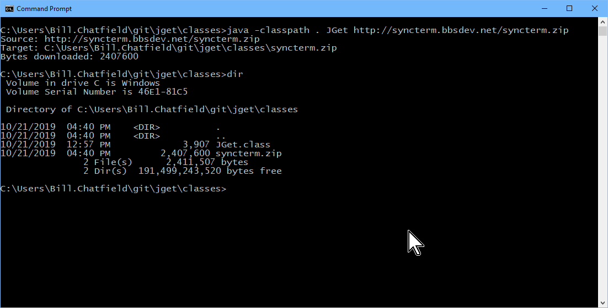

# JGet

Simple Java program to download files similar to wget. But, it is much easier to compile and install than curl or wget.
All you need is Java.

If JGet is compiled with Java 1.1 it can work on very old systems that do not have wget or curl installed. These
systems often don't have a working web browser either.

| Operating System | Java Version |
|------------------|--------------|
| Solaris 2.6      | 1.1.3        |
| Mac OS 10.3.9    | 1.3          |

## Running

The main file is JGet.class. There are several ways to run it. If all you have is this file, in the current directory,
you can run it like this:

    java -classpath . JGet http://syncterm.bbsdev.net/syncterm.zip 
   
The dot is important. It specifies that JGet.class is to be found in the current directory.

## Building

Use the build-with-java-1.x scripts to build classes/JGet.class

## Issues

Java 1.1 didn't have support for https so it will not work if your running with Java 1.1.

